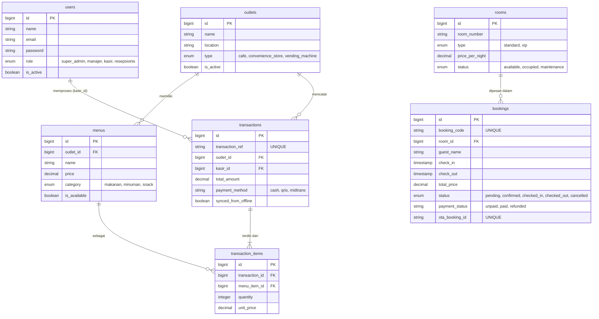

# Entity Relationship Diagram (ERD) - Bookcabin

Diagram ini menunjukkan relasi antar entitas di database Bookcabin. Diagram menggunakan skema relasional berdasarkan migrasi Laravel yang dibuat di Fase 3.

